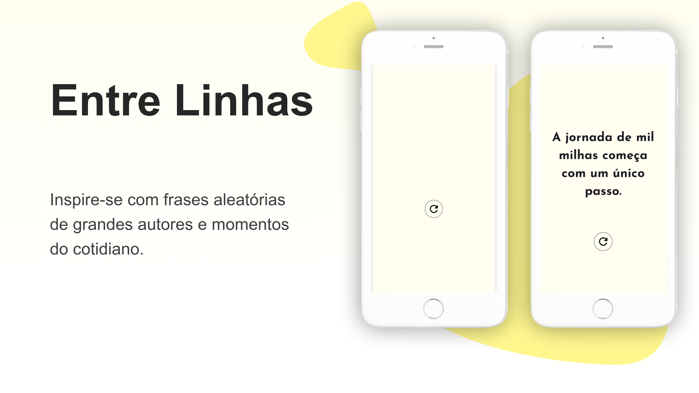
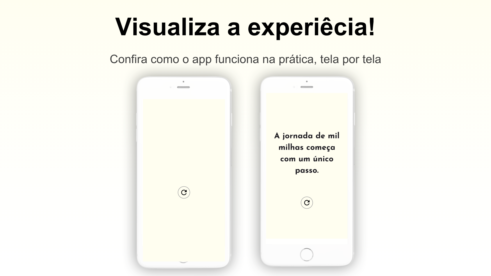

# 🌟 Entre Linhas

Este é um projeto simples desenvolvido com **Flutter**, que gera frases motivacionais aleatórias para inspirar o seu dia.

---

## 💡 Funcionalidades

- Geração de frases motivacionais aleatórias  
- Interface minimalista e responsiva  
- Botão interativo para gerar nova frase  
- Frases destacadas com tipografia personalizada

---

## 📱 Capturas de Tela

> Adicione as imagens da aplicação aqui:

---

## 🧩 Template de Apresentação

O modelo de apresentação visual foi baseado no template gratuito **Creta**, disponível em:

🔗 [Creta - Slidecore Templates](https://slidecoretemplates.com/pt-pt/producto/creta-modelo-de-apresentacao-de-aplicativo-gratuito/#google_vignette)

---

## 🚀 Tecnologias Utilizadas

- Flutter
- Dart
- Material Design
- Random (para sorteio das frases)

